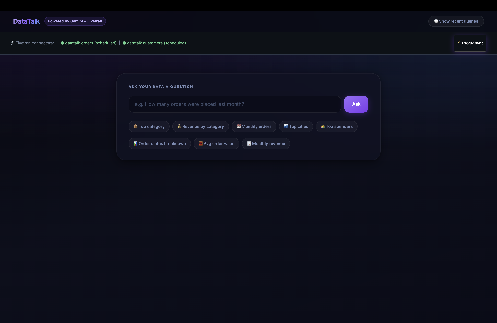
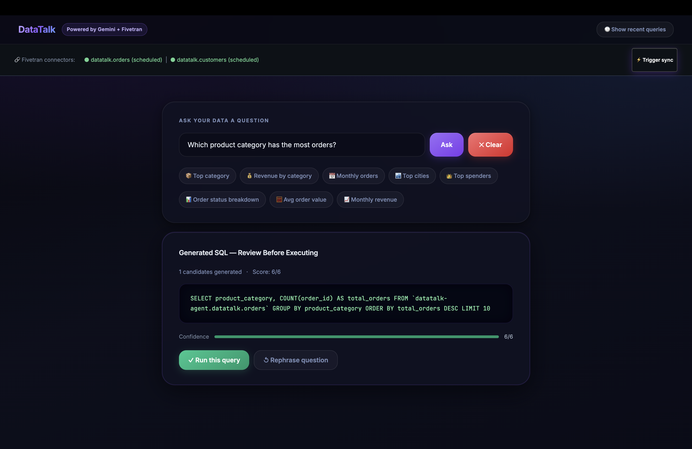
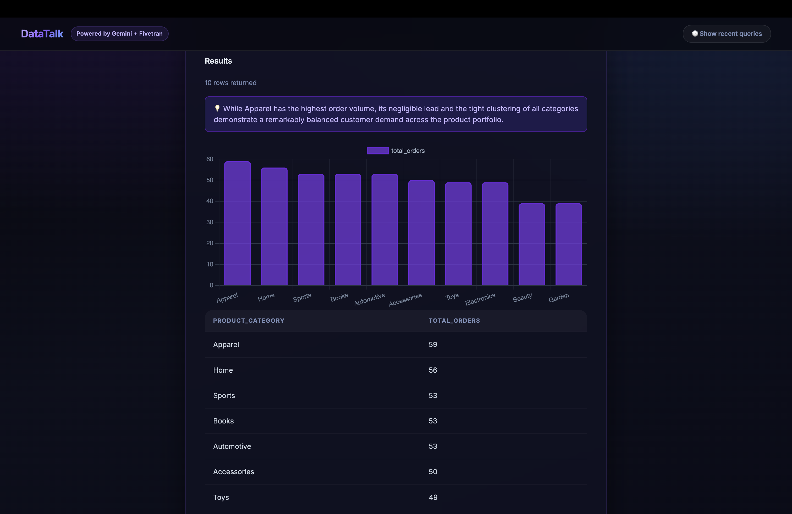
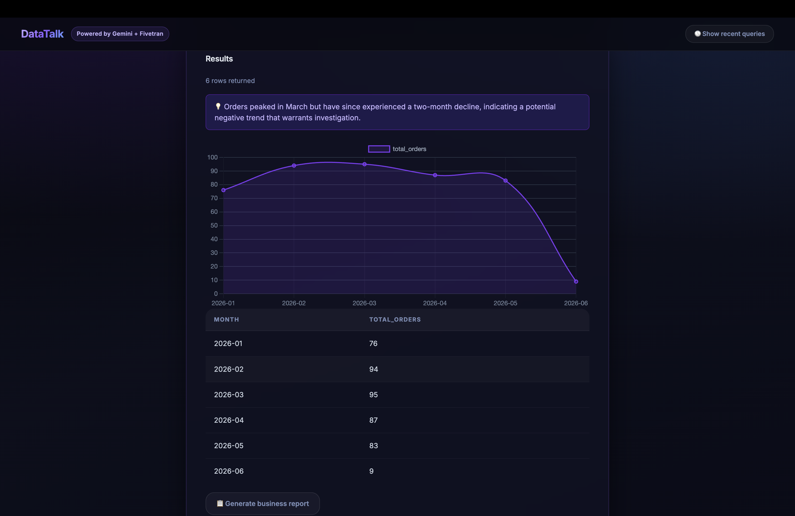
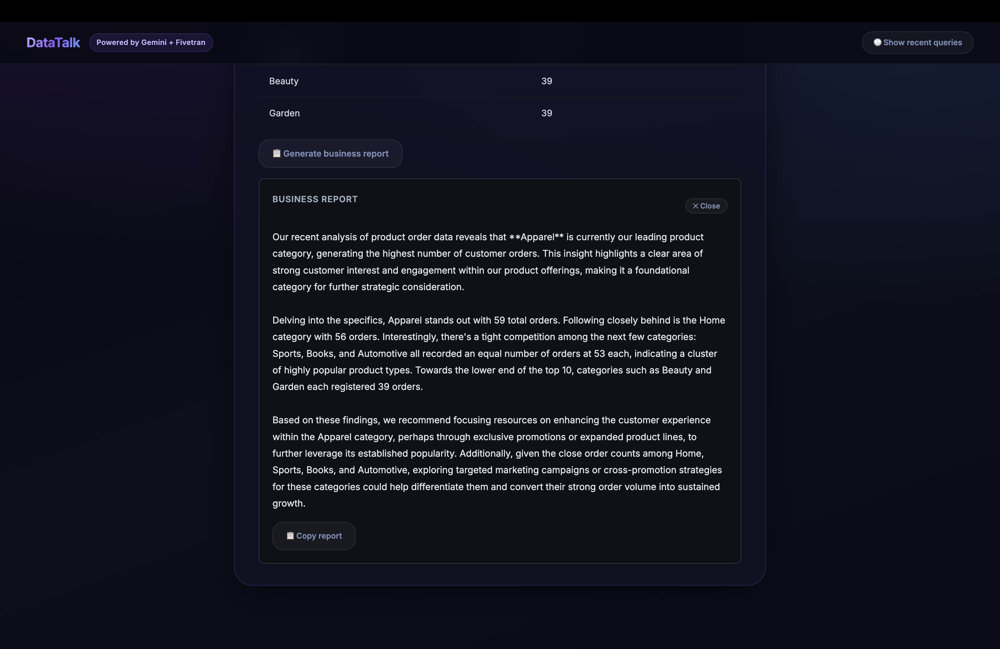
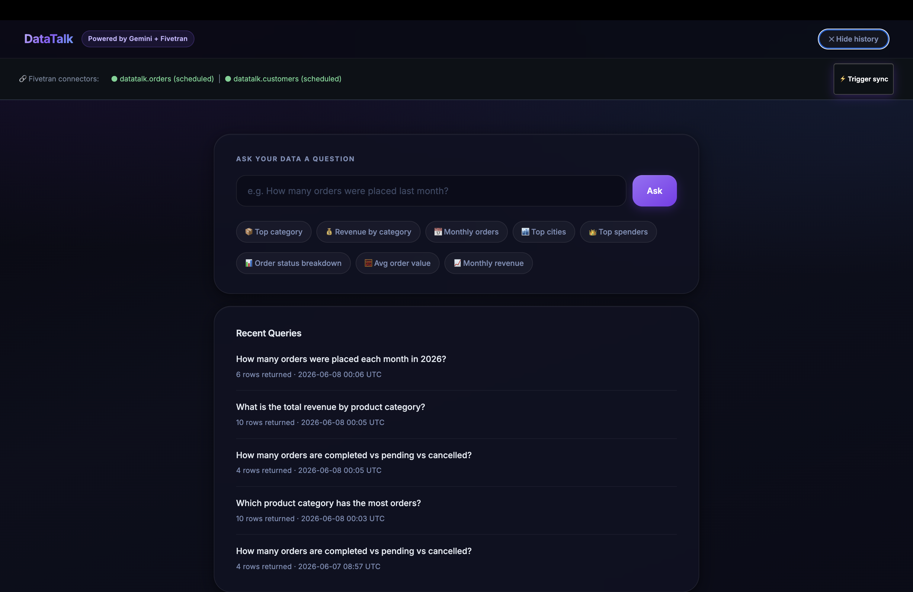

# DataTalk — Natural Language Business Intelligence Agent

> Ask your business data questions in plain English. Powered by Gemini, Fivetran, BigQuery, and Google Cloud.

[](https://opensource.org/licenses/MIT)
[](https://google.github.io/adk-docs/)
[](https://fivetran.com)
[](https://cloud.google.com)

## 🚀 Live Demo

**Demo Application:**
https://datatalk-agent-1070395408347.us-central1.run.app/

## 🎥 Demo Video

**Watch the 3-minute walkthrough:**
_Replace with your video URL_

---

## 📸 Screenshots

<p align="center">
  
  
</p>

<p align="center">
  
  
</p>

<p align="center">
  
  
</p>

### Home Page

Natural language interface where users ask business questions in plain English.

### SQL Approval Workflow

Generated SQL is presented to the user for review before execution, ensuring transparency and human oversight.

### Interactive Analytics

Results are displayed as tables and visualizations, including bar and line charts.

### AI-Powered Insights & Reports

DataTalk generates instant business insights from query results and provides detailed AI-generated reports on demand via the **Generate Report** button.

### Query History

Executed queries and generated insights are stored in Firestore, creating institutional memory and enabling future reference.

---

# The Problem

Business teams make critical decisions every day about revenue, inventory, customer growth, and operations.

Unfortunately, the data needed to make those decisions is often locked behind:

- Complex SQL queries
- Data engineering teams
- Expensive BI dashboards
- Technical knowledge most operators don't possess

As a result, non-technical users are blocked from accessing their own business insights.

**DataTalk removes that barrier.**

Users simply ask questions in plain English and receive trusted, explainable answers backed by their actual business data.

---

# What DataTalk Does

DataTalk is an AI-powered Business Intelligence Agent that allows users to interact with enterprise data using natural language.

### Key Features

✅ Ask questions in plain English

✅ Automatic SQL generation using Gemini 2.5 Flash

✅ Multi-candidate SQL generation and ranking

✅ Human approval before execution

✅ BigQuery-powered analytics

✅ Automatic chart generation

✅ AI-generated business insights

✅ Full report generation

✅ Query history and institutional memory

✅ Fivetran pipeline monitoring

✅ Manual Fivetran sync triggering

---

# Example Questions

Users can ask questions such as:

- "What was our revenue last month?"
- "Which product category generated the highest sales?"
- "Show customer growth by city."
- "How many orders were cancelled this quarter?"
- "Which customers have placed more than 10 orders?"

No SQL required.

---

# Architecture

```text
┌─────────────────────────────┐
│ Natural Language Question   │
└──────────────┬──────────────┘
               │
               ▼
┌─────────────────────────────┐
│ Flask Web Application       │
│ (Google Cloud Run)          │
└──────────────┬──────────────┘
               │
               ▼
┌─────────────────────────────┐
│ Schema Introspection        │
│ BigQuery via Fivetran MCP   │
└──────────────┬──────────────┘
               │
               ▼
┌─────────────────────────────┐
│ Gemini 2.5 Flash            │
│ Generate 5 SQL Candidates   │
└──────────────┬──────────────┘
               │
               ▼
┌─────────────────────────────┐
│ Execution-Guided            │
│ SQL Re-ranking              │
└──────────────┬──────────────┘
               │
               ▼
┌─────────────────────────────┐
│ Human Approval Gate         │
└──────────────┬──────────────┘
               │
               ▼
┌─────────────────────────────┐
│ BigQuery Execution          │
└──────────────┬──────────────┘
               │
               ▼
┌─────────────────────────────┐
│ Results + Charts + Insights │
└──────────────┬──────────────┘
               │
               ▼
┌─────────────────────────────┐
│ Firestore Query History     │
└─────────────────────────────┘
```

---

# What Makes DataTalk Different

Most "Chat with Your Data" products rely on:

```text
Question → One LLM Call → One SQL Query → Execute
```

This often fails on complex joins, aggregations, and filters.

DataTalk uses **Execution-Guided Re-ranking**:

### Step 1

Generate multiple SQL candidates using Gemini 2.5 Flash with varying temperatures.

```text
Temperature:
0.0
0.25
0.50
0.75
1.00
```

### Step 2

Preview-execute each candidate against BigQuery.

### Step 3

Score each query based on:

- SQL validity
- Successful execution
- Result shape
- Row count quality

### Step 4

Select the highest-scoring candidate.

### Step 5

Present SQL to the user for approval before execution.

This dramatically improves reliability and transparency while keeping humans in control.

---

# Fivetran Integration

DataTalk integrates with Fivetran in two powerful ways.

## 1. Data Pipeline

Fivetran automatically syncs data from business systems into BigQuery.

For the demo:

```text
Google Sheets
        ↓
     Fivetran
        ↓
    BigQuery
```

The same architecture works with any of Fivetran's 750+ connectors.

---

## 2. MCP Server Integration

The Fivetran MCP Server powers:

- Connector health monitoring
- Pipeline status checks
- Manual sync triggering
- Sync status polling

Users can refresh data directly from the interface using:

```text
⚡ Trigger Sync
```

without leaving the application.

---

# Tech Stack

| Layer            | Technology            |
| ---------------- | --------------------- |
| Agent Framework  | Google ADK            |
| LLM              | Gemini 2.5 Flash      |
| Data Pipeline    | Fivetran              |
| MCP Integration  | Fivetran MCP Server   |
| Data Warehouse   | BigQuery              |
| Memory & History | Firestore             |
| Backend          | Python Flask          |
| Frontend         | HTML, CSS, JavaScript |
| Visualization    | Chart.js              |
| Hosting          | Google Cloud Run      |

---

# Setup Instructions

## Prerequisites

- Python 3.11+
- Google Cloud Account
- Google Cloud CLI
- Fivetran Account

---

## 1. Clone Repository

```bash
git clone https://github.com/YOUR_USERNAME/datatalk-agent.git

cd datatalk-agent
```

---

## 2. Install Dependencies

```bash
pip install -r requirements.txt
```

---

## 3. Configure Google Cloud

Authenticate:

```bash
gcloud auth login

gcloud auth application-default login

gcloud config set project YOUR_PROJECT_ID
```

Enable required services:

```bash
gcloud services enable \
bigquery.googleapis.com \
vertexai.googleapis.com \
firestore.googleapis.com \
run.googleapis.com \
cloudbuild.googleapis.com
```

---

## 4. Configure Fivetran

1. Create a Fivetran account
2. Create a Google Sheets connector
3. Connect BigQuery as destination
4. Create dataset:

```text
datatalk
```

5. Obtain:

- FIVETRAN_API_KEY
- FIVETRAN_API_SECRET

---

## 5. Configure Environment Variables

Create a `.env` file:

```env
FIVETRAN_API_KEY=your_key
FIVETRAN_API_SECRET=your_secret

GOOGLE_CLOUD_PROJECT=your_project_id
GOOGLE_CLOUD_LOCATION=us-central1

GOOGLE_GENAI_USE_VERTEXAI=1
```

---

## 6. Run Locally

```bash
cd frontend

python3 app.py
```

Open:

```text
http://127.0.0.1:8080
```

---

## 7. Deploy to Cloud Run

```bash
cd frontend

gcloud run deploy datatalk-frontend \
  --source . \
  --region us-central1 \
  --allow-unauthenticated \
  --memory 1Gi \
  --timeout 120 \
  --set-env-vars \
GOOGLE_CLOUD_PROJECT=your_project,\
GOOGLE_CLOUD_LOCATION=us-central1,\
GOOGLE_GENAI_USE_VERTEXAI=1,\
FIVETRAN_API_KEY=your_key,\
FIVETRAN_API_SECRET=your_secret
```

---

# Demo Data Schema

## Orders

| Column           |
| ---------------- |
| order_id         |
| customer_id      |
| product_category |
| order_date       |
| amount           |
| status           |

---

## Customers

| Column       |
| ------------ |
| customer_id  |
| full_name    |
| email        |
| signup_date  |
| city         |
| total_orders |

---

## Project Structure

```text
datatalk-agent/
├── datatalk/
│   ├── __init__.py
│   ├── agent.py
│   └── sql_reranker.py
│
├── frontend/
│   ├── app.py
│   ├── requirements.txt
│   ├── Dockerfile
│   ├── .dockerignore
│   └── templates/
│       └── index.html
│
├── images/
│   ├── home.png
│   ├── approval.png
│   ├── bar.png
│   ├── line.png
│   ├── report.png
│   └── history.png
│
├── schema_tool.py
├── firestore_store.py
├── nl_to_sql.py
├── README.md
├── LICENSE
└── .gitignore
```

---

# Why This Matters

Data should be accessible to everyone—not just analysts.

DataTalk combines:

- Gemini's reasoning capabilities
- BigQuery's analytical power
- Fivetran's data movement platform
- Human-in-the-loop safety

to create a trustworthy AI analyst that business users can actually use.

---

# Hackathon Submission

Built for the **Google Cloud Rapid Agent Hackathon**.

### Track

**Fivetran Partner Track**

### Technologies Used

- Google ADK
- Gemini 2.5 Flash
- Vertex AI
- BigQuery
- Firestore
- Cloud Run
- Fivetran
- Fivetran MCP Server

---

# License

MIT License

---

Made with ❤️ using Google Cloud, Gemini, BigQuery, and Fivetran.
